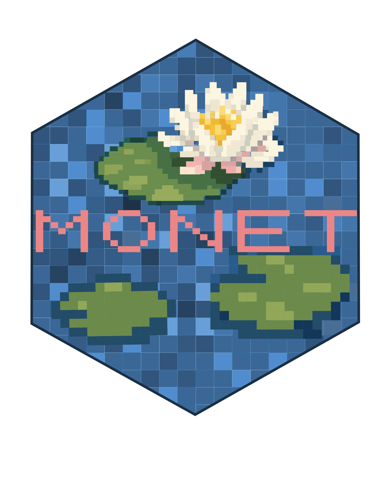

<!-- README.md is generated from README.Rmd. Please edit that file -->

```{r, include = FALSE}
knitr::opts_chunk$set(
  collapse = TRUE,
  comment = "#>",
  fig.path = "man/figures/README-",
  out.width = "100%"
)
```

# MONET 

<!-- badges: start -->
[](https://github.com/isadoo/MONET/actions/workflows/R-CMD-check.yaml)
[](https://app.codecov.io/gh/isadoo/MONET?branch=master)
[](https://lifecycle.r-lib.org/articles/stages.html#experimental)
[](https://CRAN.R-project.org/package=MONET)
[](https://r-pkg.org/pkg/MONET)
[](https://github.com/isadoo/MONET/commits/master)
[](https://www.gnu.org/licenses/gpl-3.0)
[](https://doi.org/10.5281/zenodo.placeholder)
[](https://scholar.google.com/scholar?q=MONET+package+R)
[](https://github.com/isadoo/MONET/releases)
[](https://github.com/isadoo/MONET/releases)
[](https://github.com/isadoo/MONET/blob/master/DESCRIPTION)
[](https://www.repostatus.org/#wip)
[](https://isadoo.r-universe.dev)
[](https://cran.r-project.org/)
<!-- badges: end -->

## Overview

MONET (Model of Neutral Evolution of Traits) is an R package implementation of a Bayesian linear mixed-effects model of neutral trait evolution in spatially structured populations. The model describes the expected distribution of quantitative trait values under drift, gene flow, and the demographic history of the metapopulation, providing an explicit null against which deviations can be tested.

From this neutral baseline, several hypothesis tests follow naturally:

- the **log-ratio of ancestral variances** ($\log_{AV}$) test for local or global adaptation,
- tests for **environmental associations** through fixed-effect covariates, while accounting for neutral structure,
- tests for other **individual- or experimental-level effects** (sex, age, common garden blocks, measurement year), which can be added as fixed or random effects.

MONET models population structure through a population-level coancestry matrix and an individual-level relatedness matrix, allowing for non-uniform relatedness among subpopulations (e.g. isolation-by-distance, hierarchical structure, or heterogeneous effective population sizes).

**We welcome your feedback!** If you have suggestions, questions, or find any issues, please reach out via our [GitHub Issues page](https://github.com/isadoo/MONET/issues) or contact isabela[dot]doo[at]unil[dot]ch

## Installation

You can install the development version of MONET from GitHub:

### For Contributors and Collaborators with GitHub Access
The easiest way to install MONET is:

```r
# Install devtools if you haven't already
install.packages("devtools")

# Install MONET
devtools::install_github("isadoo/MONET")
```

### Dependencies

MONET requires the following packages, which will be installed automatically:

- `kinship2` - for kinship calculations
- `hierfstat` - for beta dosages matrices
- `brms` - for Bayesian regression models
- `JGTeach` - for some of the population genetics functions
- `gaston` - for genetic data manipulation
- `Matrix` - for matrix operations
- `dplyr`, `tidyr`, `magrittr` - for data manipulation

### For Contributors: Development Installation
If you want to work on the development of MONET, you may want to clone the repository and install locally:

```r
# Clone the repository first (in your terminal)
# git clone https://github.com/isadoo/MONET.git
# cd MONET

# Then in R, install with dependencies
devtools::install(".", dependencies = TRUE)
```

## Getting Started

We provide a tutorial in the vignette to explain how to use MONET effectively. The tutorial includes detailed explanations of the model, step-by-step examples, and guidance on interpreting results.

You can find the tutorial in the [vignettes folder](vignettes/vignette_main.pdf) of the GitHub repository.

## Example

A basic workflow with MONET has two steps: estimate the coancestry matrices from genetic data, then fit the neutral model to the phenotypic data.

### Basic neutral model and $\log_{AV}$ test

```{r example, eval=FALSE}
library(MONET)

# Step 1: estimate population-level and individual-level coancestries
coancestries <- calculate_coancestries(
  genetic_data_parents       = dos_Founders,
  genotyped_parent_populations = pop,
  genetic_data_F1            = dos_F1,
  population_individual_id   = population_individual_id_df,
  column_individual          = "individual",
  column_population          = "pop_id"
)

# Step 2: fit the neutral model and test for local/global adaptation
results <- monet(
  Theta.P          = coancestries$Theta.P,
  M                = coancestries$M,
  trait_dataframe  = trait_df_pop,
  column_individual = "individual",
  column_trait     = "trait"
)
```

### Including environmental covariates

To test whether trait divergence tracks an environmental variable while controlling for neutral structure, pass it as a fixed effect:

```{r example_env, eval=FALSE}
results_env <- monet(
  Theta.P           = coancestries$Theta.P,
  M                 = coancestries$M,
  trait_dataframe   = trait_df_pop,
  column_individual = "individual",
  column_trait      = "trait",
  fixed_effects     = ~ PC_climate1 + PC_climate2
)
```

The Bayesian $p$-values on the fixed-effect coefficients test whether each covariate explains variation beyond what the neutral model predicts.

## Features

The MONET package provides:

- A Bayesian linear mixed-effects model of neutral trait evolution in structured populations
- The $\log_{AV}$ test for local and global adaptation
- Support for environmental covariates and other fixed/random effects in a single framework
- Accommodation of non-Gaussian traits through generalized linear mixed models (via `brms`)
- A coancestry matrix calculator based on the allele-sharing method of moments

## Documentation

For detailed documentation and tutorials, please see:

- The package vignettes (especially the tutorial vignette)
- Function documentation via `?function_name` in R
- Our [GitHub repository](https://github.com/isadoo/MONET)

## Contributing

We welcome contributions! Please reach out via our [GitHub Issues page](https://github.com/isadoo/MONET/issues) if you'd like to contribute or have suggestions, or by email through isabela.doo@unil.ch

## Getting Help

- For bug reports and feature requests, please use the [GitHub Issues page](https://github.com/isadoo/MONET/issues)
- For questions about usage, feel free to contact isabela.doo@unil.ch

## Citation
If you use MONET in your research, please cite: doi.org/10.1371/journal.pgen.1011871

## Acknowledgments

MONET relies heavily on several key R packages which are well managed:

- **`brms`** for Bayesian regression modeling - for the section using linear mixed models we follow many of their default values - we highly recommend users familiarize themselves with its [documentation](https://paul-buerkner.github.io/brms/)
- **`hierfstat`** for hierarchical F-statistics and genetic data analysis - see its [CRAN page](https://CRAN.R-project.org/package=hierfstat) for details
- **`kinship2`** for kinship calculations.
